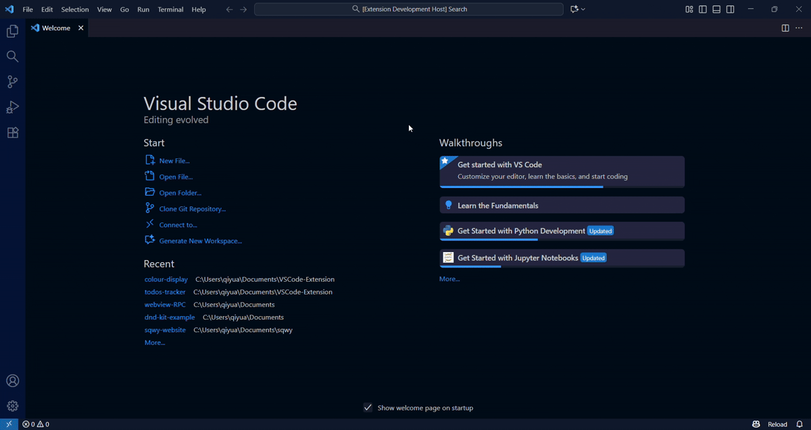

# VSCode Colour Display

A Visual Studio Code extension that displays all available VSCode CSS color variables in an organized, searchable interface.

## Features

- **Visual Color Palette**: View all VSCode theme color variables with live color swatches
- **Organized Groups**: Colors are automatically grouped by category (editor, button, input, etc.)
- **Search & Filter**: Quickly find specific color variables with real-time filtering
- **Live Theme Colors**: Displays actual colors from your current VSCode theme
- **Easy Reference**: See both the variable name and its color value

## Usage

1. Open the Command Palette (`Ctrl+Shift+P` or `Cmd+Shift+P` on Mac)
2. Search for and run the command: **"Show VSCode Colours"**
3. Browse through categorized color groups
4. Use the search box to filter variables by name

## What It Shows

This extension displays CSS variables used by VSCode for theming, including:
- Editor colors (background, foreground, selection, etc.)
- Button and input colors
- List and dropdown colors
- Badge, notification, and status colors
- And many more theme-related variables

## Requirements

- Visual Studio Code 1.85.0 or higher

## Extension Settings

This extension does not add any VS Code settings.

## Release Notes

### 0.0.1

Initial release of VSCode Colour Display
- Display all VSCode CSS color variables
- Group colors by category
- Filter/search functionality
- Live color swatches

---